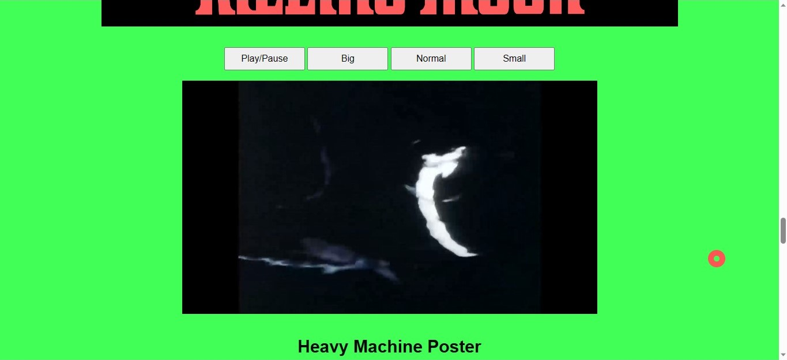
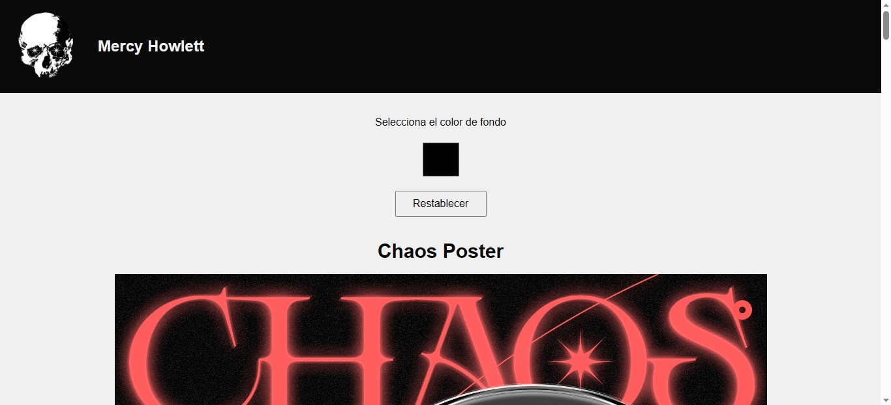
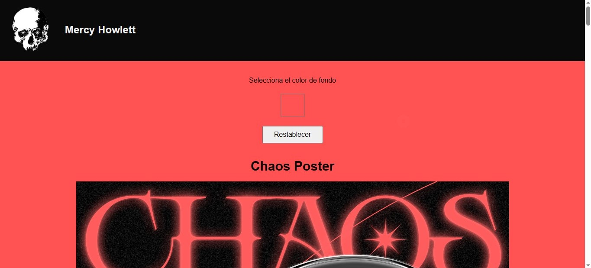
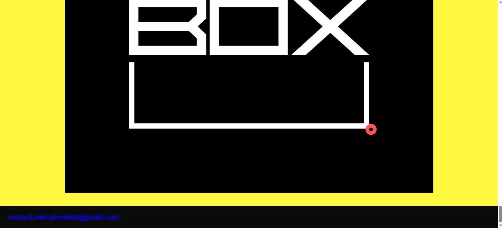
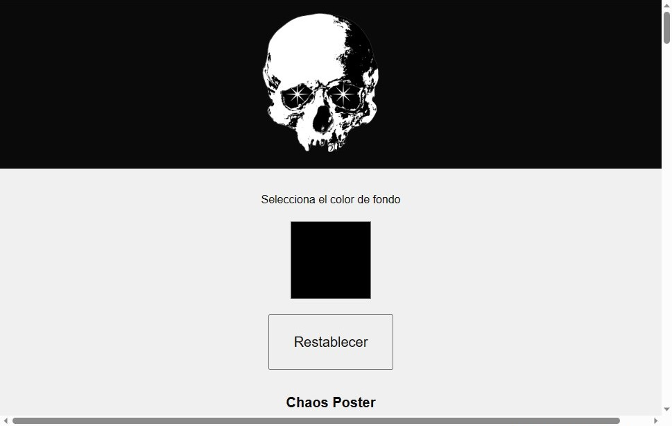
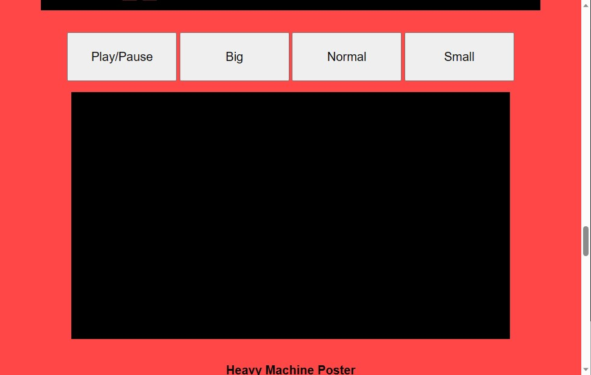
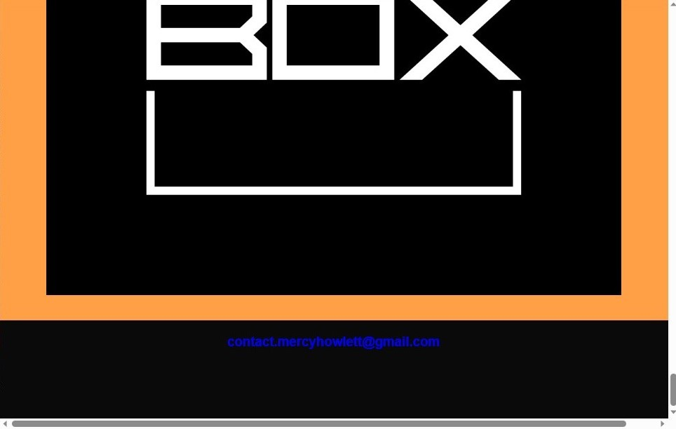

En esta actualización se agregaron diferentes elementos los cuales aumentaron en gran medida la interactividad con la página web.

**1.Video.**
El primero de estos elementos es un reproductor de video integrado a la web, esto quiere decir que no depende de páginas externas como Youtube, Vimeo, entre otros. Este reproductor
posee diferentes botones los cuales aumentan o disminuyen el tamaño de la visualización, el codigo fue extraido y adaptado de W3 School.

**2.Header y Footer.**
En cuestiones menos visibles, se agrego interactividad con el logo, por lo que ahora si presionas o clickeas la calavera del header esta te redirigirá a mi Instagram de portafolio,
mientras que en el footer se encontrara un correo electronico clickeable el cual automaticamente abrira la aplicación de correo de tu computador o celular y te abrira una redacción
con un asunto predeterminado, lo unico que no se logro acá fue cambiar la apariencia del link del footer con CSS, por alguna razón ninguna modificación que hiciera se realizaba.

**3.Elemento extra / cambio de color de background.**
Para agregarle un grado de personalización a la página web se me ocurrio añadir un selector de color interactivo que alterara la gama cromatica del background, si bien el corrector de
color funciona, lamentablemente no logre relacionar el input reset con este elemento.(Actualización: Lo logre relacionar colocandolo dentro de <form></form> pero no tiene interactividad
con los comandos de javascript)

Computador

Celular

**4.Interactividad del raton con la consola**
En cuanto a elementos internos de la página web se agrego la detección de clickeo a todos los botones.
