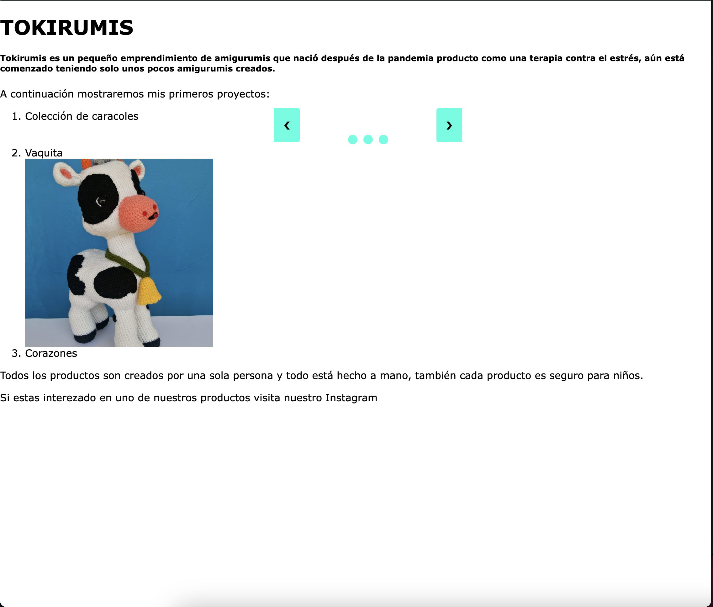
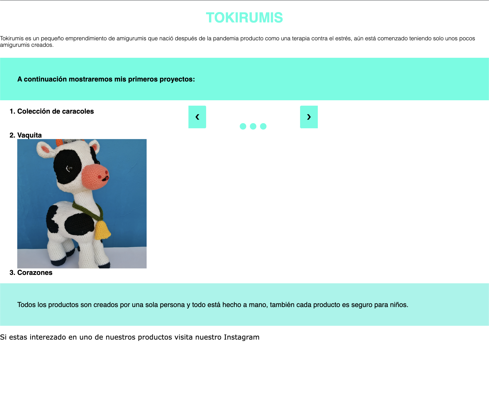
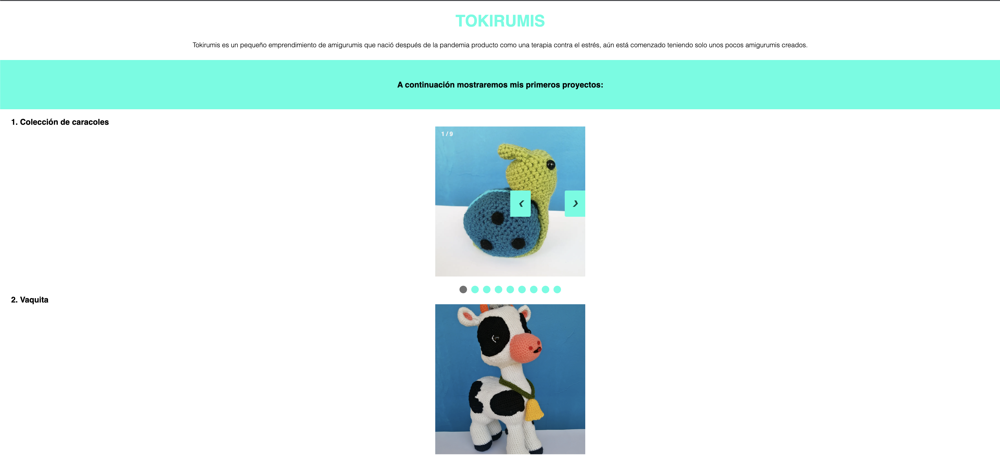
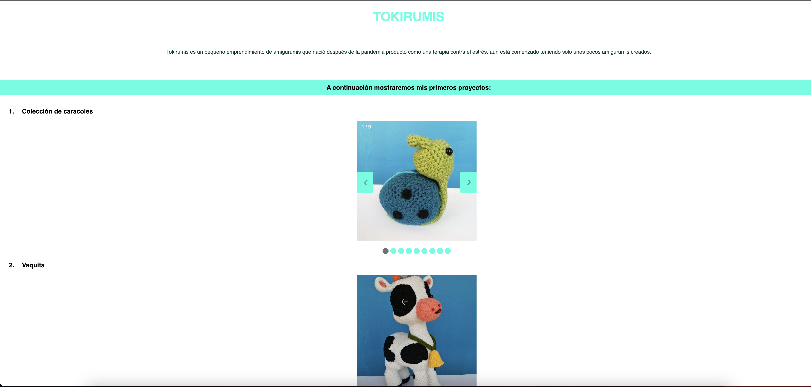
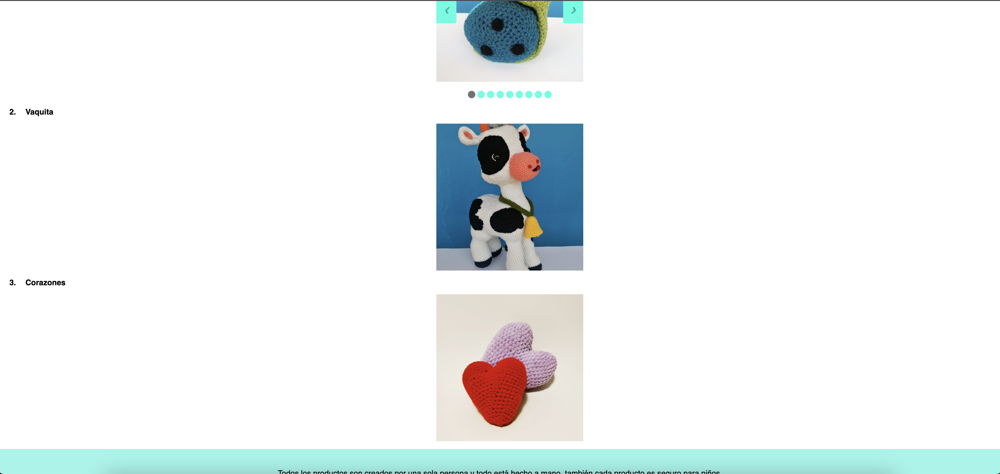
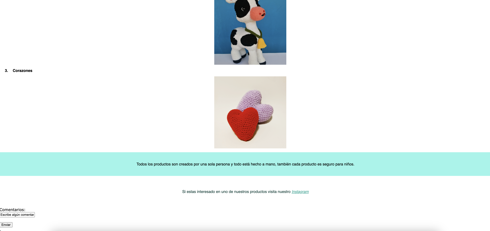
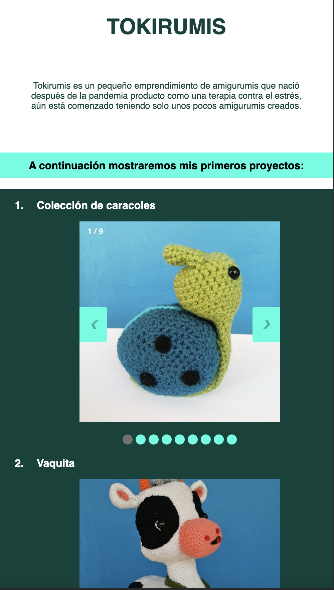
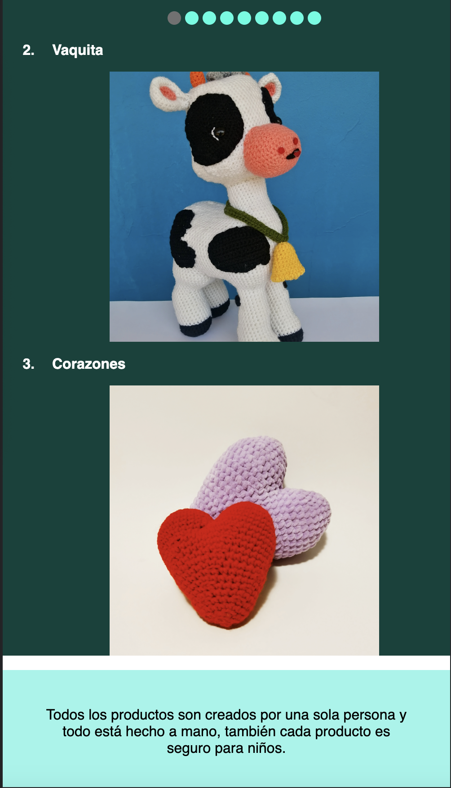
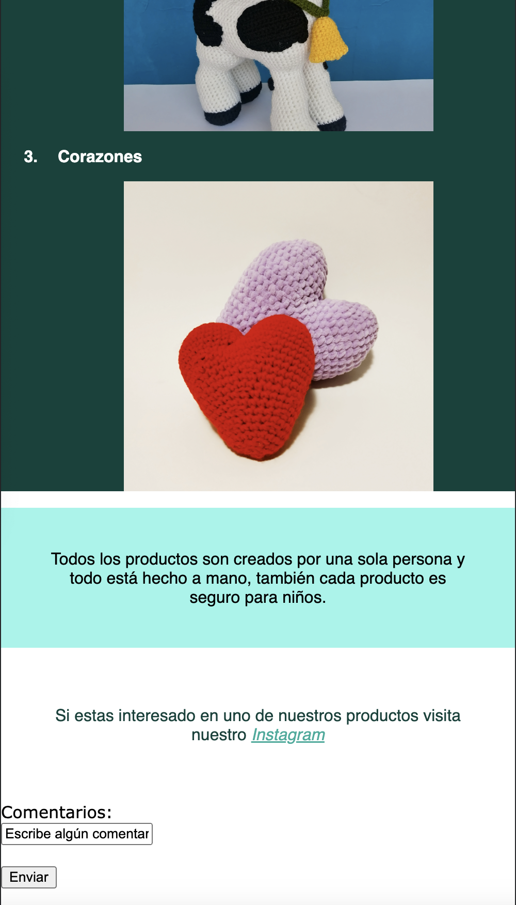

# Examen

 Para la investigación de elemento web extra investigue como realizar un carruasel de fotos, la informacioón la saque de de la pagina web https://www.w3schools.com/howto/howto_js_slideshow.asp
 
Los siguientes pantallazos corresponden a la experimentación que realice con el codigo, para así aprender como funciona.

A continuación se mostrare el proceso de como se llego al resultado final

En el siguiente pantallazo se ve como al modificar de manera erronea el codigo se modifico algo que no debia

Ahora los siguientes pantallazos corresponden al resultado final, desde la vista de un computador

Ahora los siguientes pantallazos corresponden al resultado final, desde la vista de un celular

