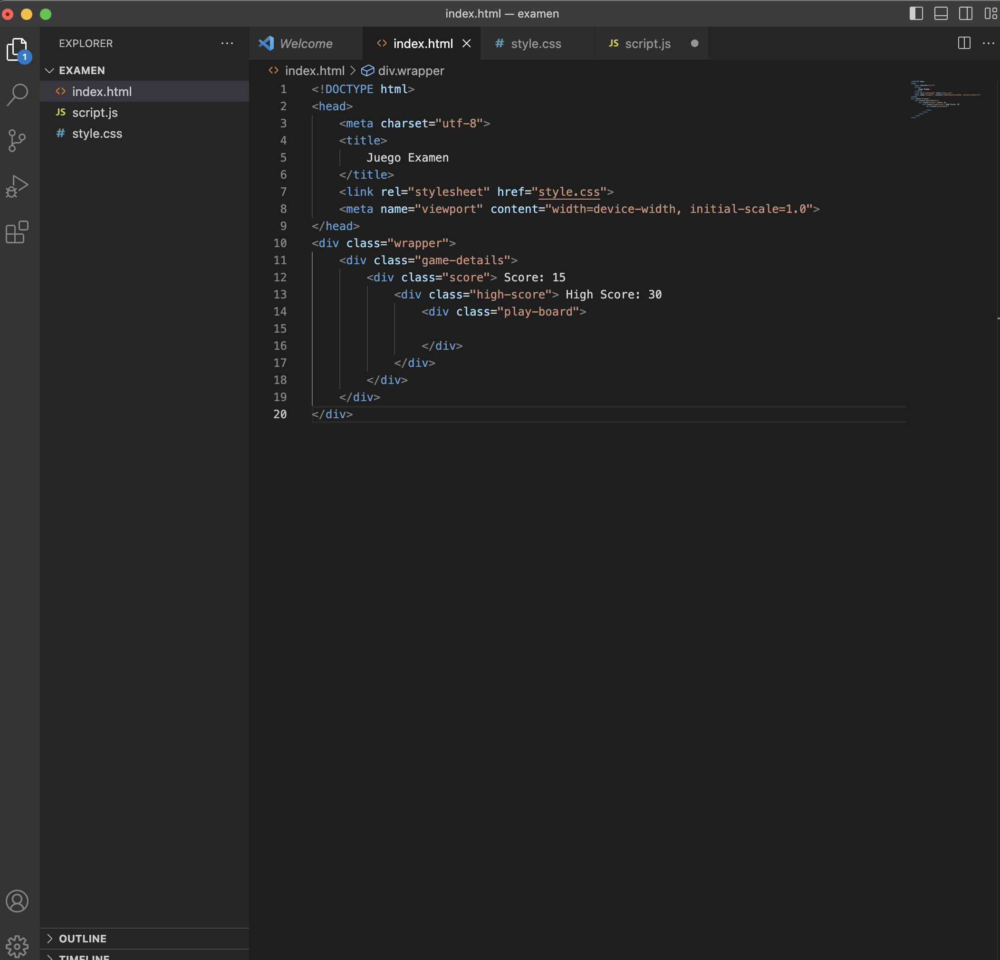
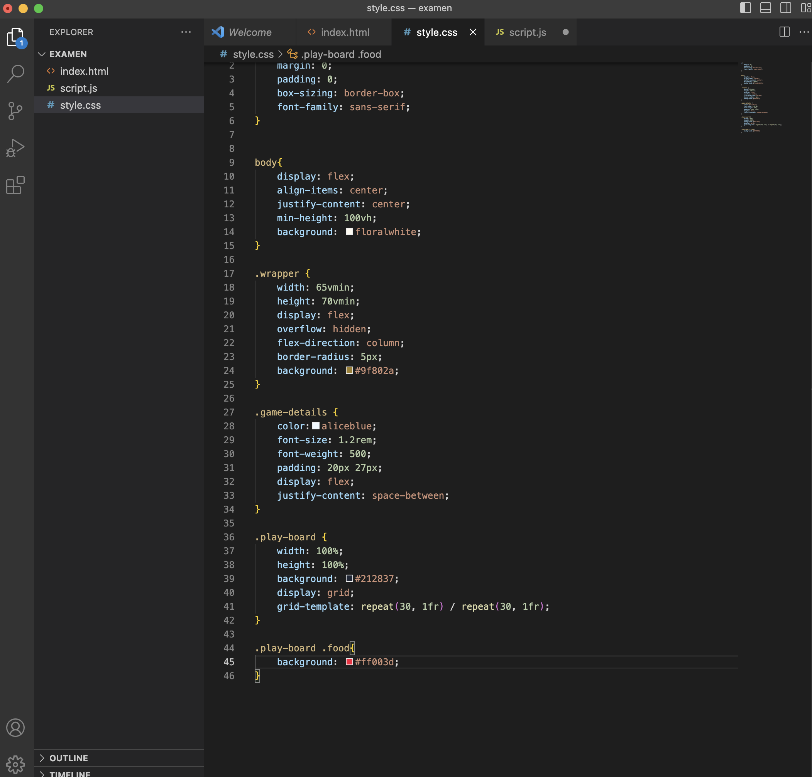
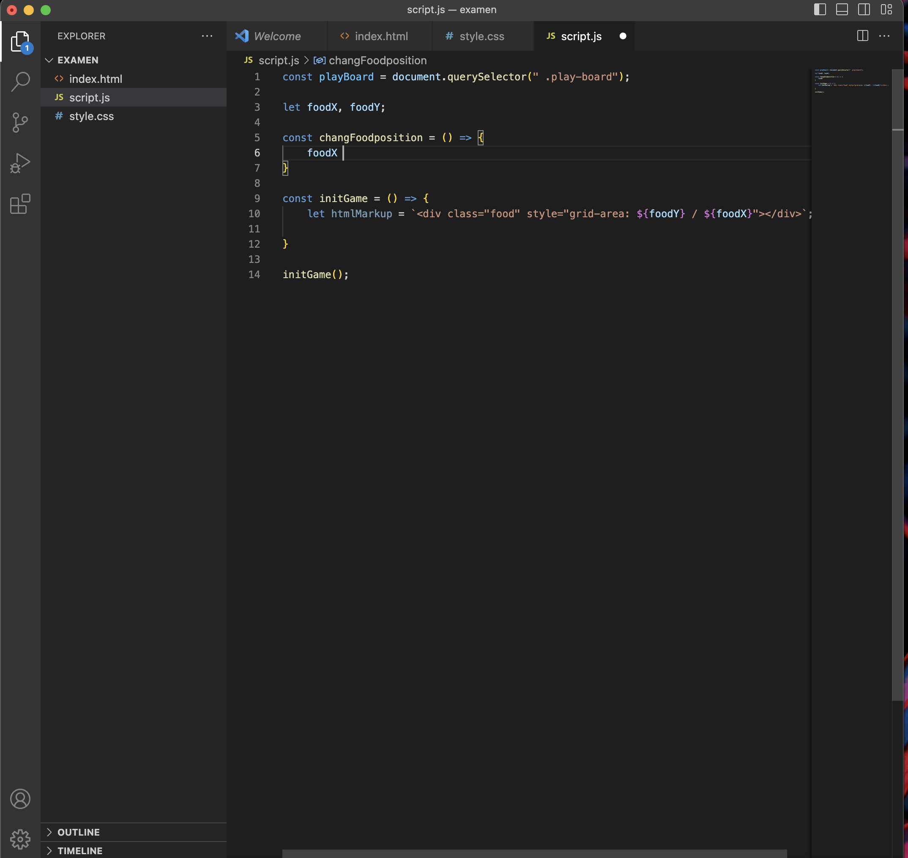
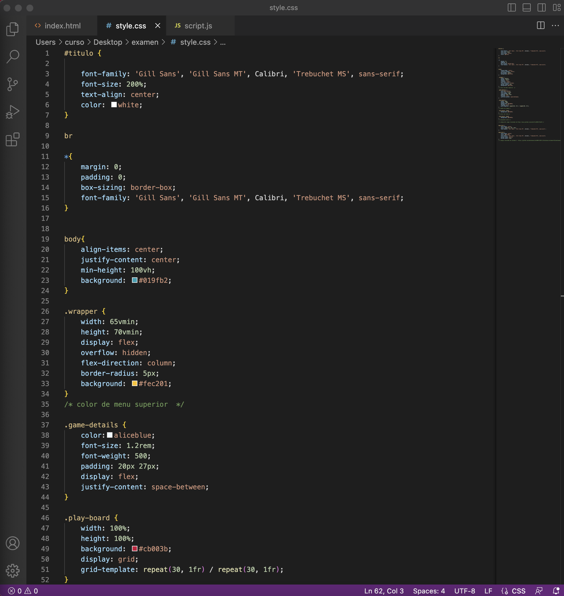
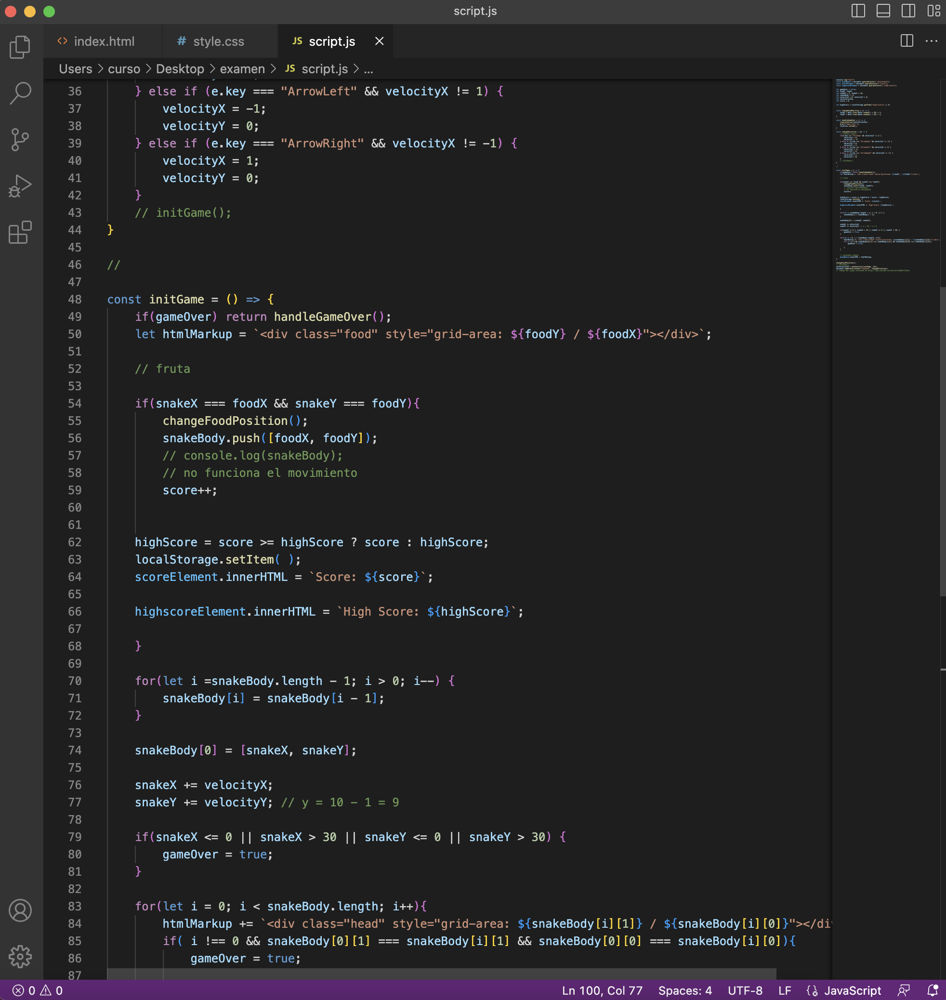
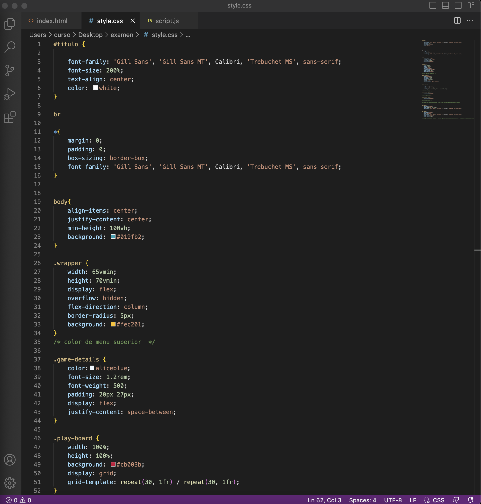
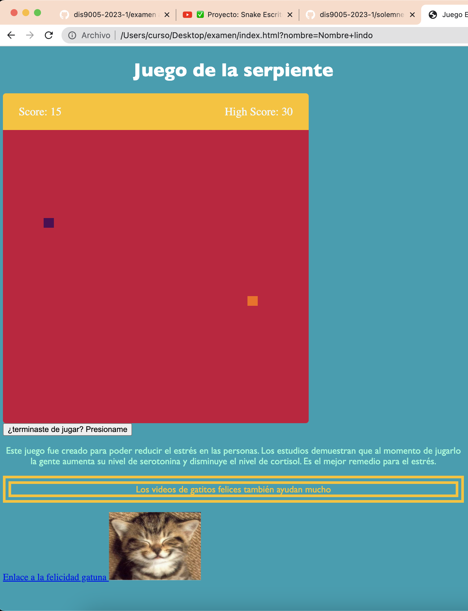

# Examen 
## Pantallazos del proceso

## Img utilizadas 

## links

-https://www.youtube.com/watch?v=QIKOrITyAtU
-https://www.w3schools.com/tags/tryit.asp?filename=tryhtml_button_test
-https://youtu.be/DHfRfU3XUEo
-https://github.com/menteneon/dis9005-2023-1/blob/main/solemne-02/menteneon/index.html
-https://www.youtube.com/watch?v=QIKOrITyAtU
